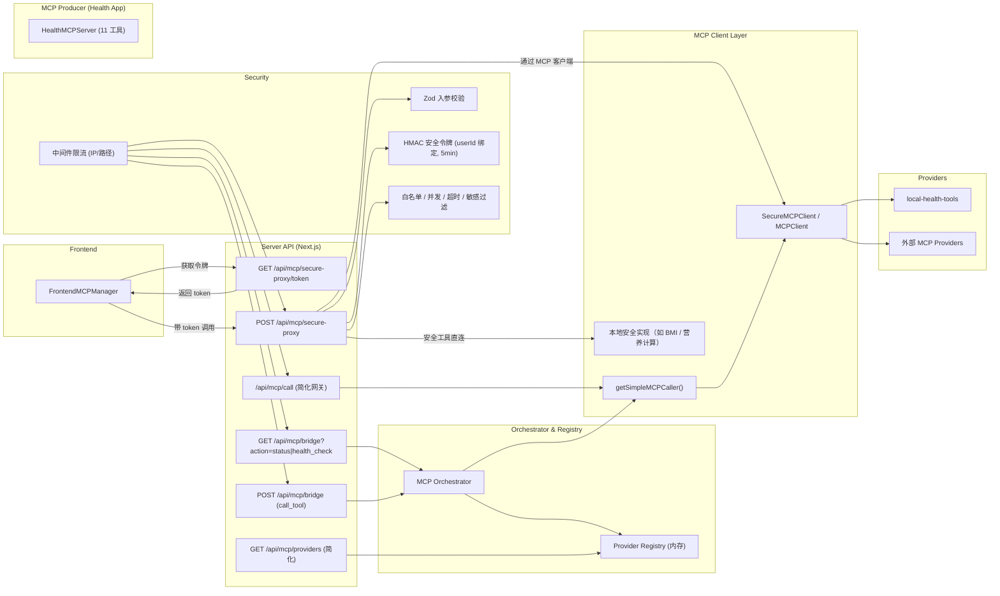
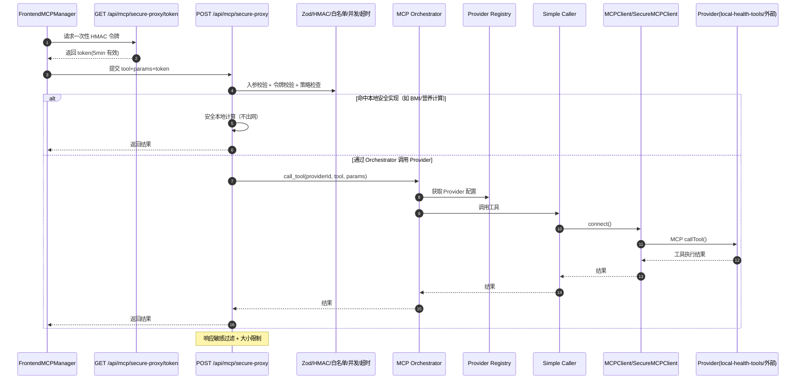

# MCP 架构与调用时序图（当前实现）

## 架构总览

## 端到端调用时序（前端 → 安全代理 → 编排 → Provider）

## 说明
- 前端统一通过安全代理调用 MCP，避免直接暴露外部 Provider；令牌采用 HMAC（与 userId 绑定，5 分钟有效）。
- `/api/mcp/bridge` 已接入 Orchestrator（统一 Provider Registry 与客户端调用），`/api/mcp/call` 作为简化网关仍可用。
- Provider Registry 当前为内存实现，后续可持久化并加密敏感字段，支持信任级策略下发。
- 可继续扩展：Redis 限流、Orchestrator 连接池/熔断、结构化日志/指标/trace。

